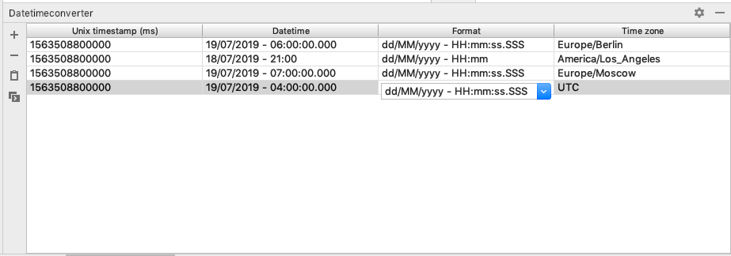

# date-time-converter-plugin

A IDEA-Plugin for converting between milliseconds and textual date time.

## Features

1. Converting between milliseconds and textual date time.

2. Formatting representation of date time. (See patterns for formatting from _DateTimeFormatter_)

3. Converting a batch of milliseconds from the clipboard. (Ctrl + V or &#8984; + V)

4. Editable dropdown with some default format patterns.

5. Editable dropdown with some default time zones ids.

6. Timestamps can be displayed as milliseconds and seconds.
